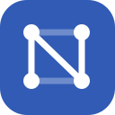
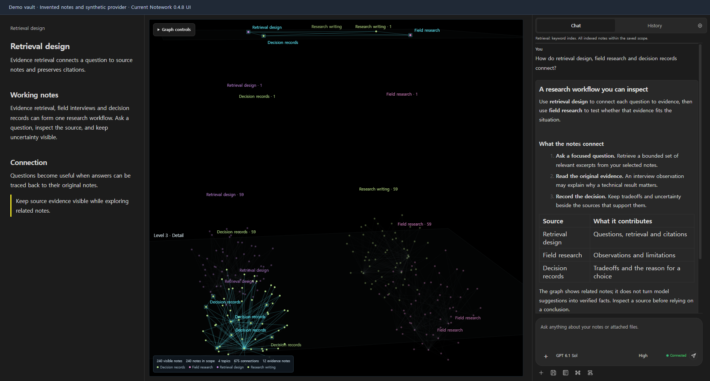
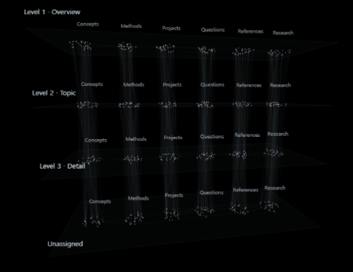
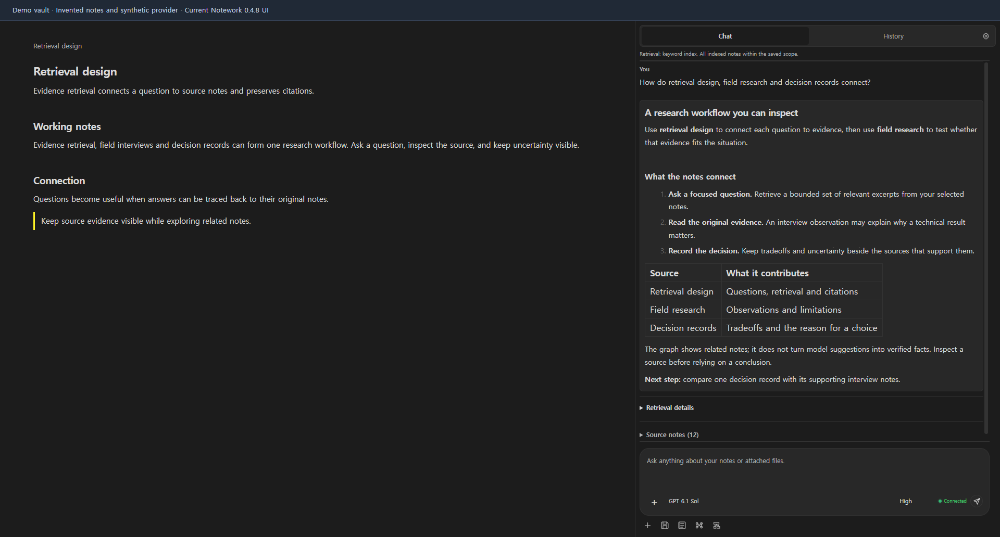

# Notework AI



**Local knowledge you can ask. Insights you can trace.**

Notework AI brings **local knowledge**, a **knowledge graph**, and **retrieval-augmented generation (RAG)** to Obsidian. Connect an eligible personal AI subscription through official Codex or Claude Code, or bring your own API key. Add optional **Jev** analysis to organize selected notes by topic category, role, hierarchy and candidate relationships.

Build an **ontology-style knowledge system** from your notes, ask questions, and explore **insights** with the reference notes and retrieval details refreshed for each question. Local retrieval works without Jev; cloud answers and optional Jev analysis use the connection you choose.

**0.4.8 alpha · Desktop only · Obsidian 1.11.4 or later.** Download matching installation files from [Release 0.4.8](https://github.com/hpsonghyun/notework-ai/releases/tag/0.4.8).

[Getting started](docs/getting-started.md) · [Website](https://hpsonghyun.github.io/notework-ai/) · [Connections and costs](docs/provider-boundaries.md) · [Security and privacy](SECURITY.md)

## See the knowledge behind an answer

Ask a question, see its relevant notes highlighted in the graph, and open the original passages behind the answer. Your next question refreshes the reference notes and retrieval details.



## From local knowledge to insights

| Part of the workflow | What it helps you do |
| --- | --- |
| **Local knowledge** | Build a local index from the folders and tags you choose. Use local Ollama embeddings for semantic search or explicitly choose keyword retrieval. |
| **Jev analysis** | Use your own Jev API key at **Build knowledge** to add structured judgments about categories, note roles, abstraction levels and candidate relationships. |
| **Ontology-style organization** | Give notes useful categories, roles, overview/topic/detail levels and relationship labels, so a collection has a structure you can explore. |
| **Knowledge graph** | Navigate related note stars, inspect the current question's sources, and open the original notes beside your conversation. |
| **Augmented RAG** | Retrieve relevant passages locally and optionally extend retrieval with saved AI relationship judgments. Inspect the actual source excerpts and retrieval route used for each question. |
| **Insights** | Ask your connected AI to compare ideas, follow connections and develop interpretations you can check against your notes. |

Saved relationship judgments can bring a small set of related notes into retrieval beyond the initial matches. Source and scope checks apply before those passages reach the answer model. This is graph-assisted retrieval within Notework; the navigable star positions are a display layout.

Ontology-style organization describes note metadata and relationship judgments. Compare AI interpretations with the original evidence as you develop an insight.

## Build knowledge you can ask

Arrange selected notes by topic and by overview, topic and detail layers. Ask from this knowledge, then inspect the reference notes refreshed for each question.



Knowledge arranged by topic and hierarchy, ready to inform your answers. [View original image](assets/notework-knowledge-layers.png).

1. **Connect your AI.** Use an eligible personal subscription through official Codex or Claude Code, or your own API key.
2. **Build your knowledge.** Add your Jev API key for optional advanced organization of selected notes into categories, roles, hierarchy and candidate relationships. Basic local retrieval works without Jev.
3. **Ask and inspect.** Each question refreshes its reference notes, retrieved excerpts and graph highlights. Open the original passages and retrieval details behind an answer.


“Ontology-style” means a useful organization of your actual notes. **Categories** group topics; **roles** describe a note's purpose; **hierarchy** separates overview, topic and detail; **relationships** connect candidate sources. Jev adds these judgments during an explicit knowledge build using your own key. You can also use the selected AI analysis route. Local embeddings or keyword retrieval work without Jev, with basic local structure.

Ask through your own answer connection, then inspect **Source notes** and **Retrieval details**. The current question refreshes its source set, graph highlights and retrieval trace: route, matched chunks, valid/candidate notes, applicable filters and excluded stale material. Open the original passage to check an answer; organization and model judgments remain suggestions to inspect.


## Work with your notes, in their own workspace

- **Choose the context.** Include folders and tags, exclude material that should stay out, and apply your scope. The default knowledge build processes all eligible Markdown notes in that scope; optional limits are explicit.
- **Ask and inspect.** Read streamed Markdown answers in the right sidebar. Each question refreshes its reference notes and retrieval details. Expand source evidence, inspect retrieved excerpts, and open original notes. Source links make review easier; they do not certify every model claim.
- **Explore the knowledge graph.** Navigate a dark 3D starfield with stable topic colors, hierarchy and role views, source highlights, cursor-centered zoom, and note previews. Viewing and filtering the graph makes no AI request. Use **Pin selected context** when you want to constrain later retrieval; ordinary graph filters only change the view.
- **Follow the conversation.** After each completed answer, the selected answer AI automatically organizes completed exchanges into topics, refinements, branches, and follow-ups. Open the summary dock to inspect exact original questions and answers. Each update is an additional bounded request under that connection's usage limits or API billing.
- **Keep reusable work.** Save conversations as ordinary vault Markdown notes, optionally save after every answer, and use a local prompt library. Inserting a prompt never sends it automatically.



The interface is English. Your notes and questions can use other languages. Graph categories, hierarchy levels, relationships, and AI answers remain suggestions to inspect against the original material. Star positions are a navigation layout, not a calibrated similarity-distance plot.

## Bring the connection that fits your work

| Connection | What you need | Costs and boundaries |
| --- | --- | --- |
| ChatGPT through Codex | Separately installed official Codex app-server and your own official ChatGPT login | Uses your account's available models and Codex usage limits. No guarantee that every plan includes every model. Notework does not import ChatGPT conversations or silently switch to API billing. |
| Claude through Claude Code | Separately installed, unmodified official Claude Code CLI; direct sign-in with your own eligible account | Claude Code controls authentication and eligibility. Model discovery is not proof of entitlement. Provider subscription conditions and usage limits apply. |
| OpenAI or Anthropic API | Your own provider API key | API usage is billed separately from subscriptions. |
| Ollama chat | A running local Ollama server and an installed chat model | Local inference has no per-call cloud API charge. Your hardware, model license, and server configuration still matter. |
| Local embeddings | A running local Ollama server and an installed embedding model, or explicit keyword retrieval | Embedding inference stays on the local loopback server. A model download starts only when you request it. It is separate from the answer model. |
| Optional Jev analysis | Your own Jev API key and available model | At **Build knowledge**, Jev can judge categories, roles, hierarchy levels, and candidate relationships. Separate provider usage applies. Jev is not required for local retrieval and does not structure conversations. |

The plugin code is MIT-licensed, with no plugin access fee. AI services have their own terms and charges. Conversation structure runs automatically after a completed answer: up to the latest **20 eligible completed question/answer pairs**, within a **32 KiB serialized UTF-8 request limit**, go to the same selected answer model. Eligibility verification covers at most **64 distinct source references** across that window. Exchanges outside that verified window remain readable locally; this is not a knowledge-build limit. Opening the summary dock makes no request. A structure failure leaves the answer intact. [Full connection and data-flow details](docs/provider-boundaries.md).

## Installation and first use

For manual installation, download the version-matched `main.js`, `manifest.json`, and `styles.css` from [Release 0.4.8](https://github.com/hpsonghyun/notework-ai/releases/tag/0.4.8), then follow these steps:

1. Use desktop Obsidian 1.11.4 or later. Close Obsidian before replacing an existing plugin build; preserve existing settings and private index files.
2. Put the three matching files in `<vault>/.obsidian/plugins/notework-ai/`, using your actual Obsidian configuration folder if it differs.
3. Reopen Obsidian and enable **Notework AI** in **Settings → Community plugins**. Keep plugin-installation and active-plugin-list Sync disabled when using a phone with the same vault.
4. Open **Settings → Notework AI → Setup**. Connect an answer model, prepare local embeddings or choose keyword search, optionally connect Jev, select folders/tags, then build knowledge.
5. Run **Notework AI: Open Notework**, ask a question, and inspect its sources. Use **Show knowledge graph** to open the graph beside your current document and chat.

[Detailed setup and attachment limits](docs/getting-started.md) · [Mobile status and recovery](docs/mobile-quickstart.md)

**Mobile is under active development and currently disabled.** This release is desktop-only. A PC update does not disable an older phone copy; disable Notework on the phone itself. Ordinary Markdown note sync can continue.

## Understand what leaves your computer

Notework searches and stores its index locally. When you send a cloud question, the selected provider receives your question, relevant source excerpts and note paths, eligible prior turns, and any text files you explicitly attach. Automatic conversation structure adds a separate request containing eligible completed exchanges. Optional AI/Jev knowledge analysis sends selected note excerpts during a build. A local Ollama route sends requests to the loopback server; remote retention depends on the cloud provider you choose.

Desktop subscription connections discover official CLI installations through PATH or configured installation paths, inspect installation metadata, launch subprocesses, and create dedicated directories in the system temporary folder outside your vault. Notework attempts to restrict these requests to supplied text, but these controls are not an operating-system sandbox or a guarantee about every upstream runtime action. The plugin does not install Codex, Claude Code, or Ollama for you.

API keys and retained direct-login credentials use **Obsidian SecretStorage**, which is vault-local and is not an OS keychain or isolation from other installed plugins. Knowledge caches contain excerpts and vectors without encryption. Saved conversation notes may sync with the vault and contain exact messages and source metadata. Prompt notes and the configured conversation archive folder are excluded from retrieval. No developer analytics endpoint or automatic diagnostic-upload feature was found in the reviewed implementation; provider traffic still occurs as described. [Read SECURITY.md before using sensitive notes](SECURITY.md).

## Development and support


If Notework helps you organize your knowledge and inspect the evidence behind an answer, consider giving the repository a star.

<!-- NW_FUNDING -->
<a href="https://buymeacoffee.com/namsonghyun2"></a>

Optional support does not unlock features.
<!-- /NW_FUNDING -->

One repository contains the implementation, tests, `docs/` website, and shared assets. The project Pages address is [hpsonghyun.github.io/notework-ai](https://hpsonghyun.github.io/notework-ai/). The older personal-site repository is not a second development target. [Repository layout](docs/repository-layout.md) · [Roadmap](docs/roadmap.md) · [Contributing](CONTRIBUTING.md)

Use Node.js 24.x, matching the current package engine range. Build before running checks that load the compiled host.

```sh
npm ci
npm run build
npm test
```

Use the repository's [issue tracker](https://github.com/hpsonghyun/notework-ai/issues) for support. Share invented notes and sanitized reproduction steps. Never include credentials, login codes, provider logs, or private vault content. For vulnerabilities, follow [the private reporting guidance](SECURITY.md#report-a-problem).

Desktop screenshots use invented notes and synthetic provider state. The promotional visual is a conceptual brand illustration based on the Notework logo. These assets do not establish real account access, paid provider results, universal operating-system support, or community approval. Release verification is tracked separately; this page does not invent performance figures, testimonials, rankings, or download counts.

[MIT license](LICENSE). Notework AI is an independent community project; Obsidian and the AI providers do not endorse it.
